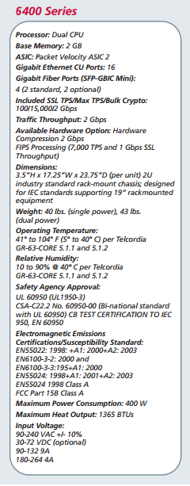

# Ejercicios Tema 4

#### 1. Buscar información sobre cuánto costaría en la actualidad un mainframe. Comparar precio y potencia entre esa máquina y una granja web de unas prestaciones similares. 

Actualmente la compañía IBM tiene una gama de mainframes (z Systems) que van desde los 75.000 hasta los 2 millónes de dólares.

#### 2. Buscar información sobre precio y características de balanceadores hardware específicos. Compara las prestaciones que ofrecen unos y otros. 

- Cisco Systems Catalyst 6500 Series 
	
	Precio en amazon.com: (6513-E) $12,561.64
	

- Coyote Point E350si
	
	Precio en amazon.com: $1,899.85
	

- F5 Networks BIG-IP 6400
	
	Precio en eBay.com: $3,750.00 
	
	

#### 3. Buscar información sobre los métodos de balanceo que implementan los dispositivos recogidos en el ejercicio 4.2  

Los balanceadores de CISCO usan un algoritmo propio de balanceo, el resto usa algoritmos convencionales como los vistos en teoría.

#### 4. Instala y configura en una máquina virtual el balanceador ZenLoadBalancer.


	1. Descargamos una ISO de la web oficial y desde este link directo
	2. Si queremos instalarlo en una debian debemos hace lo siguiente con	
	```apt-get update && apt-get install zendloadbalancer``` 
	```deb http://zenloadbalancer```.sourceforge.net/apt/x86 v2/
	3. Una vez instalado podemos entrar a la gestión https://ip:444 con user/pass admin:admin
	4. Ahora nos toca crear un farm con la ip virtual desde: manage->farms->add farm
	5. Asignamos backends/real servers, en la configuración del farm esta la opción add real servers, para añadir cada backend.
	6. Ahora solo queda revisar que todo funcione correctamente atacando la ip definida en el farm.  

#### 6. Buscar información sobre los bloques de IP para los distintos países o continentes. Implementar en JavaScript o PHP la detección de la zona desde donde se conecta un usuario 

La página ``` https://www.countryipblocks.net ``` nos permite conocer de donde procede nuestra IP, además de poder proporcionarnos diferentes IPS por país.

#### 7. Buscar información sobre métodos y herramientas para implementar GSLB. 

Hay varias implementaciones posibles, con mayor o menor complejidad:
 - Uso del sistema de DNS
 - Redirección HTTP
 - GSLB basado en DNS
 - GSLB usando protocolos de enrutamiento