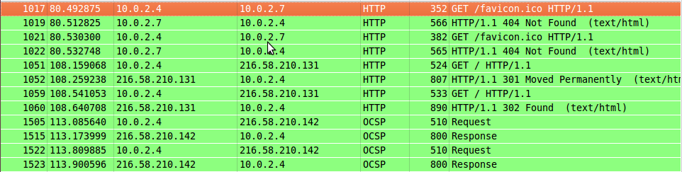

# Ejercicios Tema 5

#### 1. Buscar información sobre cómo calcular el número de conexiones por segundo.  

- Podemos usar el comando ``` netstat ``` para conocer el número total de conexiones en cualquier servidor Linux.

- En Apache podemos saberlo usando ``` apache2ctl status | grep request ```.

- En nginx añadiendo el siguiente código al fichero de configuración: 
	``` 
	location /nginx_status {
	    # Turn on stats
	    stub_status on;
	    access_log   off;
	    # only allow access from 192.168.1.5 #
	    allow 192.168.1.5;
	    deny all;
	} 
	```

	y accediendo al apartado de administración (``` http://your-domain-name-here/nginx_status ```).

#### 2. Instalar wireshark y observar cómo fluye el tráfico de red en uno de los servidores web mientras se le hacen peticiones HTTP. 




#### 3. Buscar información sobre características, disponibilidad para diversos SO, etc de herramientas para monitorizar las prestaciones de un servidor. 

Aquí enumero diferentes software de monitorización:

- Load Impact

- Pingdom

- Zabbix 