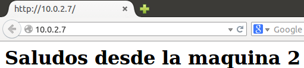
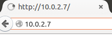
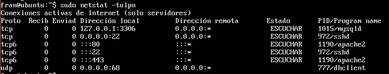

# Ejercicios Tema 6

#### 1. Aplicar con iptables una política de denegar todo el tráfico y en una de las máquinas de prácticas. Comprobar el funcionamiento. 
#### Aplicar con iptables una política de permitir todo el tráfico en una de las máquinas de prácticas. Comprobar el funcionamiento. 

- Permitir todo el tráfico
    ``` 
    iptables −P INPUT ACCEPT
    iptables −P OUTPUT ACCEPT
    iptables −P FORWARD ACCEPT  
    ```
    

- Denegar todo el tráfico
    ``` 
    iptables -P INPUT DROP
    iptables -P OUTPUT DROP
    iptables -P FORWARD DROP   
    ```
    


#### 2. Comprobar qué puertos tienen abiertos nuestras máquinas, su estado, y qué programa o demonio lo ocupa. 




#### 3. Buscar información acerca de los tipos de ataques más comunes en servidores web (p.ej. secuestros de sesión). Detallar en qué consisten, y cómo se pueden evitar. 

- Denegación de servicio
Los ataques por denegación de servicio envían paquetes IP o datos de tamaños o formatos raros que saturan los equipos de destino o los vuelven inestables.

- Inyección SQL
La inyección de código SQL es una técnica de ataque usada para explotar sitios web que construyen sentencias SQL a partir de entradas facilitadas por el usuario.

- Fuerza bruta
Proceso automatizado de prueba y error utilizado para conseguir un nombre de usuario, contraseña, número de tarjeta de crédito o clave criptográfica.

