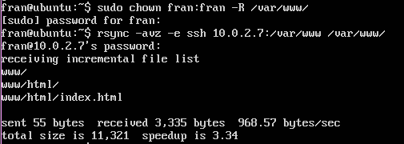
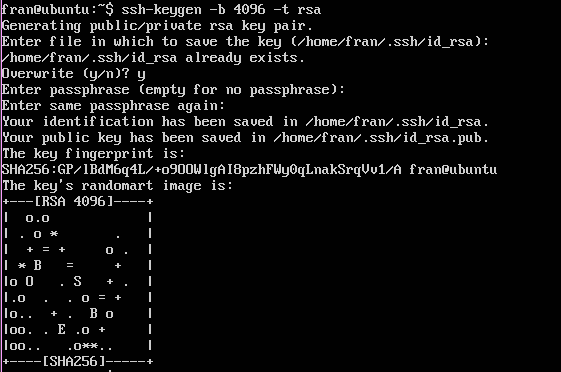
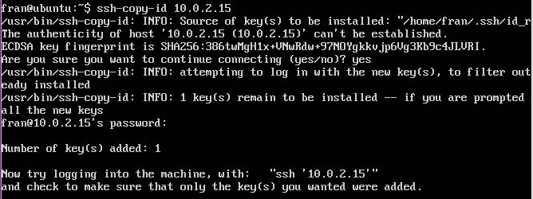

# Práctica 2

## Clonación de contenido entre máquinas
Con la herramienta Rsync procedemos a realizar una clonación de los contenidos entre 2 máquinas. Para instalarla, podemos hacerlo mediante: 
- ``` sudo apt-get install rsync ```

Una vez instalada, para hacer la copia bastaría con ejecutar el siguiente comando:
- ```rsync -avz -e ssh ipmaquina1:directorio_a_clonar directorio_objetivo ```


> Nota: El directorio a clonar debe pertenecer al usuario de la máquina (comando ``` chown ```)

## Configuración SSH
Tras saber como funciona el Rsync, vamos a configurar una conexión SSH que nos permita ejecutarlo sin que tenga problemas de identificación con la otra máquina.
Primeramente ejecutamos:
``` ssh-keygen -b 4096 -t rsa ```
para generar las claves necesarias



Tras esto y para finalizar la configuración, usamos el comando ``` ssh-copy-id maquina1 ``` para copiar las claves en la otra máquina, permitiendo la conexión al otro equipo sin necesidad de contraseña


## Programación del Rsync
Una vez configurada la conexión SSH, ya podemos establecer la clonación para que se realice de forma periódica gracias a ``` cron ```, un administrador de procesos en segundo plano de Unix. Para ello, accedemos a su archivo de configuración situado en ``` /etc/crontab ``` y añadimos una linea para crear un proceso nuevo.
En este caso pondremos, por ejemplo,
``` */3 *  * * *   root    /rutaDelScriptQueEjecutaLaClonacion ```
para hacer que se ejecute de forma regular cada 3 minutos.