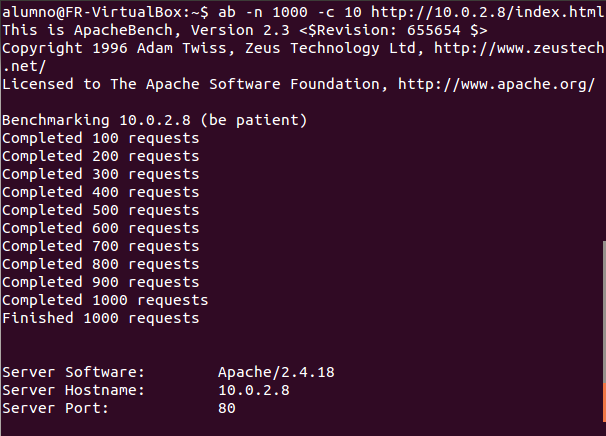

# Práctica 3 Balanceo de carga

## Balanceo con el servidor nginx
nginx es un servidor web que permite balancear el tráfico, vamos a configurarlo: 
Primeramente, comprobamos si está instalado en la máquina que hará las veces de balanceador.
- ``` sudo apt-get install nginx ```

Tras acabar la instalación, modificamos el fichero ``` /etc/nginx/conf.d/default.conf ``` tal y como muestra la siguiente imagen:


Y podemos lanzar ya el servicio con el comando ``` sudo systemctl start nginx ```, si no obtenemos ningún mensaje de error ya estará funcionando todo de forma correcta, pero podemos comprobarlo accediendo al cliente y haciendo peticiones al balanceador o haciendo peticiones desde el propio balanceador a sí mismo como vemos en la imagen:


De esta manera ya estará configurado el balanceo con el algoritmo Round-Robin. Podemos cambiar este hecho y hacer que balancee mediante ponderación añadiendo la orden ``` weight ``` con sus respectivos valores a las IP de los servidores web en el fichero de configuración(``` /etc/nginx/conf.d/default.conf ```) como podemos ver a continuación:


##Balanceo de carga con HAPROXY
HAProxy es un proxy y además un balanceador de carga´. Es un software muy preparado para el balanceo de carga y construir una infraestructura de altas prestaciones.
La configuración básica es muy sencilla:

En primer lugar, comprobamos si está el programa instalado en la máquina que funciona como balanceador:
- ``` sudo apt-get install haproxy ```

Una vez instalado, accedemos a su archivo de configuración situado en ``` /etc/haproxy/haproxy.cfg ``` e introducimos la siguiente información:


Con esta configuración, HAProxy ya está preparado para su trabajo, iniciamos el servicio (``` sudo service haproxy start ```) y podemos probar su funcionamiento como con nginx (cliente externo o llamadas al localhost):


## Balanceo de carga con Pound (tarea opcional)
Pound es un proxy que permite el balanceo de carga. Permite el balanceo tras la siguiente configuración:
Comprobamos si está instalado o no en el balanceador de carga con el comando:
- ``` sudo apt-get install pound ```

Tras instalarlo, hay que entrar al archivo ``` /etc/pound/pound.cfg ``` y modificarlo como la siguiente imagen:


Solo falta entrar al fichero ``` /etc/default/pound ``` y activar el servicio Pound poniendo la variable ``` startup=1 ```

Iniciamos el servicio (``` sudo service pound start ```) y podemos probar su funcionamiento:


## Probar los balanceadores sometiéndolos a alta carga
Usaremos la herramienta Apache Benchmark para hacer las pruebas con el siguiente comando ``` ab -n 1000 -c 10 http://IP-LoadBalancer/index.html ```
Los resultados con los 3 balanceadores anteriormente explicados se muestran a continuación: 

### Testeo en Nginx


### Testeo en HAProxy



### Testeo en Pound


