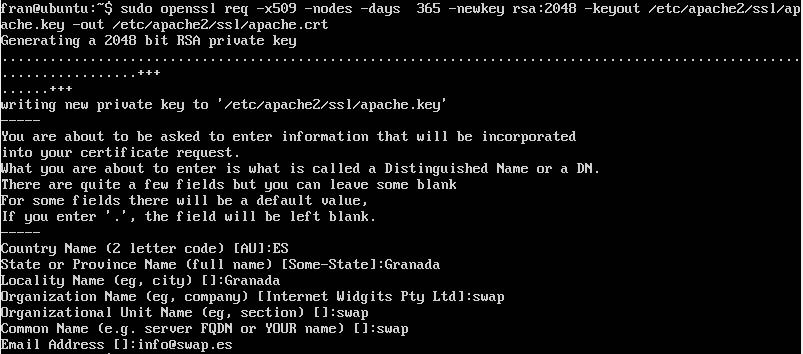
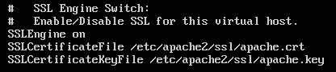
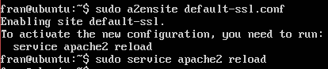
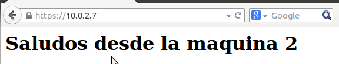
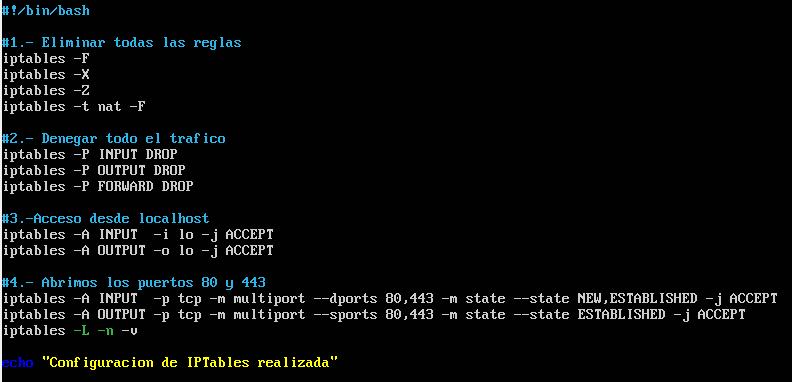
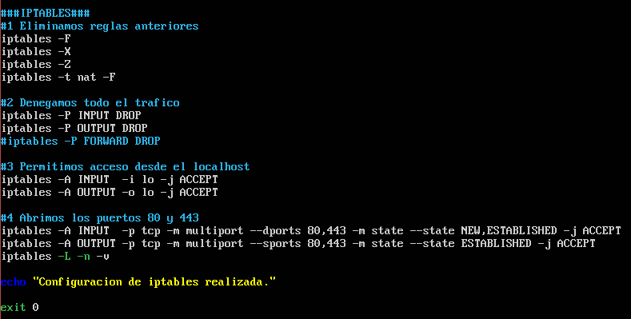
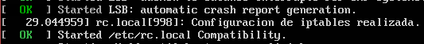
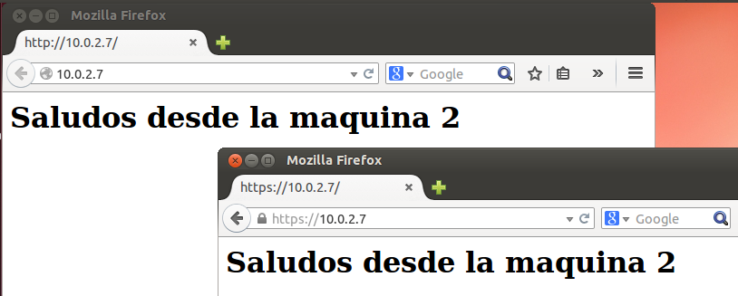

# Práctica 4 Seguridad

El objetivo de esta práctica es llevar a cabo la configuración de seguridad de la granja web.

## Instalación certificado SSL
Un certificado SSL permite ofrecer seguridad, ya que informa a los visitantes que el sitio web es real y confiable.

### Generación del certificado
Ejecutamos los siguientes comandos:

- ``` a2enmod ssl ``` para activar el módulo SSL de Apache
- ``` service apache2 restart ``` Reiniciamos el servicio
- ``` mkdir /etc/apache2/ssl  ``` Creamos un directorio donde estarán los certificados necesarios
- ``` openssl req -x509 -nodes -days 365 -newkey rsa:2048 -keyout /etc/apache2/ssl/apache.key -out /etc/apache2/ssl/apache.crt ``` Generamos los certificados

Al ejecutar el último comando nos pedirá un serie de datos parar configurar el dominio:


Con esto ya tendremos generados los certificados.

### Instalación de los certificados
Tras el paso anterior, editamos el fichero de configuración ```default-ssl.conf``` y agregamos los comandos:
- ``` SSLCertificateFile /etc/apache2/ssl/apache.crt  ``` 
- ``` SSLCertificateKeyFile /etc/apache2/ssl/apache.key ``` 
justo como aparece en la siguiente imagen:


Por último, usamos ``` a2ensite default-ssl.conf ``` y reiniciamos apache, para comprobar que la configuración ha surtido efecto:




## Configuración del cortafuegos

Un cortafuegos es una parte fundamental de un sistema o una red que está diseñada para bloquear el acceso no autorizado, permitiendo al mismo tiempo comunicaciones autorizadas.

El comando ``` iptables ``` es el encargado de permitirnos modificar los parámetros del cortafuegos, para ello estableceremos un listado de reglas que definirán las acciones a realizar.

Vamos a crear un script para las iptables:


Con este script se controlará el cortafuegos, pero tiene una pega; hay que inciarlo cada vez que se inicie la máquina.

Para evitar este tedioso proceso, situaremos el script en ``` /etc/rc.local ``` para que se ejecute de manera automática cada vez que se inicie la máquina.


Reiniciamos la máquina y comprobamos que todo funciona correctamente:


