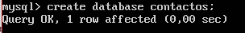

# Práctica 5 Replicación de bases de datos MySQL

El objetivo de esta práctica es llevar a cabo la clonación manual de BD entre máquina y configurar la estructura maestro-esclavo entre 2 máquinas, haciendo posible la clonación automñatica de la información.

## Creación BD
Para la ejecución de la práctica, vamos a crear una BD en MySQL, para ello, accedemos a mysql tal y como aparece en la imagen:


Una vez dentro, creamos la BD con ``` create database nombreDB; ``` y tras crearla, introducimos ``` use nombreDB; ``` para usar esa DB. 

Para terminar, crearemos una tabla y le introduciremos datos. Para crear la tabla, simplemente hay que poner ``` create table nombreTabla (campo tipoCampo); ``` y tendremos la tabla preparada. Para introducir datos a esta tabla, basta con teclear ``` insert into nombreTabla(campo) values (valor); ```. Con esto, hemos terminado la creación de la BD para esta práctica, en mi caso he creado una BD llamada contactos y una tabla datos con 2 campos que veréis a continuación:




## Replicación de BD con mysqldump
mysqldump es una herramienta que sirve para realizar clonacion de BD de nuestra máquina.
La sintaxis de uso es: ``` mysqldump ejemplodb -u root -p > /root/ejemplodb.sql; ```

Pero primeramente, antes de realizar este proceso, necesitamos evitar que se acceda a la BD para evitar errores y/o pérdida de resultados debido a la constante actualización en el servidor BD principal. Para ello, haremos ```  FLUSH TABLES WITH READ LOCK; ```. Con esto ya podemos realizar el comando mysqldump como el que he realizado yo:


Con este paso hecho ya podemos ir a la máquina esclavo para realizar una copia del archivo .sql:


Damos por finalizada la copia no sin antes hacer un inciso en que hay que crear la BD en el esclavo para que mysqldump funcione correctamente.


## Replicación de BD mediante configuración maestro-esclavo
La opción anterior es un método viable, pero depende de que la realice un operador a mano. Sin embargo, MySQL permite la configuración de un demonio para realizar estas replicaciones sobre un esclavo a partir de los datos almacenados por el maestro.

Para empezar, haremos la configuración del maestro. Para ello vamos a editar el fichero ``` /etc/mysql/mysql.conf.d/mysqld.cnf ```
- Comentamos el parámetro ``` bind-address ```
- 

- Indicamos el archivos para almacenar el log de errores:
``` log_error = /var/log/mysql/error.log ```

- Establecemos el id del servidor ``` server-id = 1 ```
- Establecemos el registro binario ``` log_bin = /var/log/mysql/bin.log ```

Después de modificar lo anterior, ejecutamos ```/etc/init.d/mysql restart ``` y así reiniciamos el servicio.


Procedemos a configurar el esclavo:
- Establecemos el id del servidor ``` server-id = 2 ```
- El resto de parámetros es igual que en el maestro

Reiniciamos con el comando puesto anteriormente.
Volvemos al maestro y realizamos las siguientes sentencias:
- Creamos al usuario esclavo


- Realizamos las siguientes secuencias:
``` GRANT REPLICATION SLAVE ON *.* TO 'esclavo'@'%'			IDENTIFIED BY 'esclavo'; FLUSH PRIVILEGES; FLUSH TABLES; FLUSH TABLES WITH READ LOCK; ```

 

Con esto, ya hemos finalizado con el maestro, pasamos al esclavo:
- Introducimos esta sentencia, cambiando los datos oportunos: 
``` CHANGE MASTER TO MASTER_HOST='192.168.31.200',MASTER_USER='esclavo', MASTER_PASSWORD='esclavo', MASTER_LOG_FILE='mysql-bin.000001', MASTER_LOG_POS=501, MASTER_PORT=3306; ```

Si no ha dado problemas, volvemos al maestro y desbloqueamos las tablas y en el esclavo podemos ejecutar ``` START SLAVE; ``` y comprobaremos que todo funciona. Si queremos comprobar que todo funciona, podemos verlo tecleando ``` SHOW START SLAVE\G; ``` y si vemos que la variable "“Seconds_Behind_Master" es diferente de NULL es que todo funciona correctamente.


