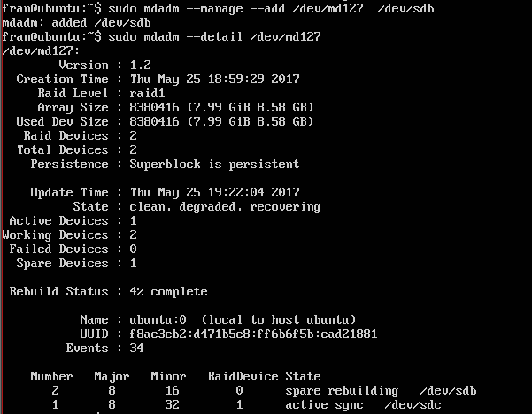

# Práctica 6 Discos en RAID

El objetivo de esta práctica es llevar a cabo la configuración dos discos en RAID 1.

##  Configuración del RAID
El primer paso para el comienzo de esta práctica será comprobar si tenemos el software necesario, tecleamos ``` sudo apt-get install mdadm ``` e instalamos en caso de que no lo tengamos.

Con el comando ``` sudo fdisk -l ``` podremos obtener la informacion de los discos que usaremos para hacer el RAID, en nuestro caso  ```/dev/sdb``` y ```/dev/sdc``` :


Con esto ya podremos crear el RAID1 usando el dispositivo ```  /dev/md0 ``` realizando el comando ``` sudo mdadm -C /dev/md0 --level=raid1 --raid-devices=2 /dev/sdb /dev/sdc ``` 


Tras la creación, procederemos a darle formato con ``` sudo mkfs /dev/md0 ```


y creamos el directorio en el que se va a montar la unidad del RAID con:
- ``` sudo mkdir /dat ```
-  ```sudo mount /dev/md0 /dat ```

Podemos comprobar que el proceso se ha realizado de forma correcta con el comando ``` sudo mount ```


Y para comprobar el estado del RAID introducimos ``` sudo mdadm --detail /dev/md0 ``` 


Para acabar la configuración, haremos que el montado del RAID sea automático al arrancar el sistema. Editamos el fichero ``` /etc/fstab ``` y añadimos el UUID del RAID (para consultar el UUID ejecutamos la orden ``` ls -l /dev/disk/by-uuid/ ```), como vemos a continuación:


## Pruebas de funcionamiento
Tras acabar la configuración, podemos realizar múltiples testeos para comprobar que todo funciona correctamente:
- Simular fallo en uno de los discos: ``` sudo mdadm --manage --set-faulty /dev/md0 /dev/sdb ```


- Extraer uno de los discos: ``` sudo mdadm --manage --remove /dev/md0 /dev/sdb ```


- Añadir un disco: ``` sudo mdadm --manage --add /dev/md0 /dev/sdb ```

